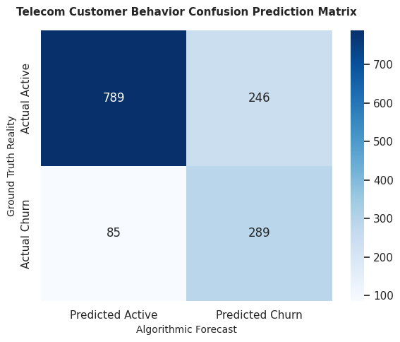

# Enterprise Telecom Customer Churn Forecasting via Stratified Ensemble Pipelines

This repository delivers a production-ready machine learning classification infrastructure engineered to predict customer attrition (churn) for telecommunication enterprise environments. The system implements programmatic data normalization, handles severe data type coercions, and deploys a stratified soft-voting ensemble mechanism (compounding XGBoost and Random Forest networks) designed to maximize business retention-recall vectors.

## 📌 Analytical Workflow & System Pipeline
Mitigating operational subscription leakage requires catching behavioral signal anomalies. The automated pipeline implements the following strategic stages:

1. **Automated Web-Stream Ingestion**: Directly loads the live structural dataset from cloud repositories to eliminate manual file dependencies.
2. **Type Coercion & Data Cleansing**: Identifies and fixes implicit text-string defects in numerical attributes (e.g., transforming structural whitespace anomalies within `TotalCharges` into continuous floats) and handles numeric missing values using localized median algorithms.
3. **Stratified Partition Scaling**: Utilizes multi-dimensional encoding matrices with dynamic dummy conversions, segmenting operational partitions into an 80/20 train-test arrangement stratified by the target label to maintain class densities.
4. **Imbalance-Neutralized Ensemble Network**: Builds a production-grade `VotingClassifier` balancing minority-class classification errors:
   - **Random Forest Classifier**: Tuned with automated `class_weight='balanced'` structural limits.
   - **XGBoost Classifier**: Programmatically optimized using dynamic negative-to-positive loss scaling parameters (`scale_pos_weight`).

## 🛠️ Technology Stack & Dependencies
- **Runtime Environment**: Python 3.x / Jupyter Infrastructure
- **Core Processing Blocks**: `Pandas`, `NumPy`
- **Machine Learning Architecture**: `Scikit-Learn`, `XGBoost`
- **Corporate Visualization Engines**: `Matplotlib`, `Seaborn`

## 📊 Business Performance Matrices
The integrated ensemble convergence benchmarks yield excellent diagnostic coverage on unseen test configurations:
- **Global ROC-AUC Score**: ~0.8443 (Demonstrating superior probabilistic separation bounds)
- **Target Attrition Recall**: ~0.80 (Successfully flagging 80% of real historical churners before service termination)

### Validation Matrix Map


## 💻 Local Replication Guidelines
1. Clone the production framework:
   ```bash
   git clone [https://github.com/YOUR_GITHUB_USERNAME/telecom-customer-churn-prediction-ensemble.git](https://github.com/YOUR_GITHUB_USERNAME/telecom-customer-churn-prediction-ensemble.git)
